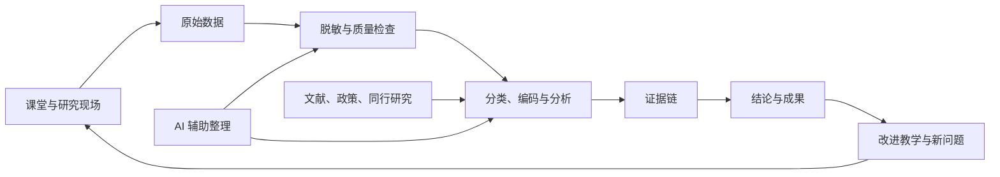

# 教科研数据仓库

> [!important] 仓库定位
> 面向高中技术与工程教师，把日常教学、真实数据、文献政策、同行研究和教师反思连接成可追溯的教科研证据链。

## 每天从这里开始

1. 有一条零散信息 → 放入 [[../00_Inbox/README|收件箱]]。
2. 完成一节课 → 使用 [[../90_模板/每日教学数据模板|每日教学数据模板]]。
3. 有教学体会 → 使用 [[../90_模板/教学反思模板|教学反思模板]]。
4. 读到文献、政策或同行案例 → 分别使用对应模板。
5. 想启动课题 → 先建 [[../90_模板/研究主题模板|研究主题]]，再建 [[../90_模板/真实数据规划模板|真实数据规划]]。

## 核心导航

| 区域 | 解决的问题 | 入口 |
|---|---|---|
| 分类与规则 | 这个资料应放哪里、应填什么字段？ | [[数据分类总览]] · [[标签与字段规范]] |
| 学科数据 | 技术与工程课堂到底记录什么？ | [[高中技术与工程学科数据字典]] |
| 日常教学 | 每节课发生了什么、教师怎么调整？ | [[../10_Daily/教学数据/README|教学数据]] · [[../10_Daily/教学反思/README|教学反思]] |
| 研究项目 | 每个课题的研究问题、行动和成果 | [[../20_研究项目/README|研究项目总览]] |
| 研究资料 | 文献、AI 摘要、政策、同行研究、研究方向 | [[../30_研究资料/README|研究资料总览]] |
| 真实数据 | 数据需求、采集、登记、质量、伦理 | [[../40_真实数据/README|真实数据总览]] |
| 学生交流 | 课堂问答、个别辅导、作品反馈、访谈与后续行动 | [[../40_真实数据/09_学生交流/README|学生交流数据]] |
| 材料分解工作流 | 文章、论文、课题与教学材料的数据化处理 | [[../05_工作流/教科研材料数据化分解工作流]] |
| 分析与成果 | 从数据到证据、结论、论文和案例 | [[../50_分析与成果/README|分析与成果总览]] |
| 原始资料 | PDF、表格、图片、录音等原件 | [[../60_原始资料/README|原始资料说明]] |
| AI 协作 | AI 可以做什么、哪些必须人工确认 | [[AI协作边界与流程]] |

## 数据闭环

## 动态数据看板

![[../99_系统/Bases/教科研资料总览.base]]

![[../99_系统/Bases/教学与真实数据总览.base]]

## 本周最小行动

- [ ] 每个教学日记录至少一条课堂数据。
- [ ] 每周形成一篇教学反思。
- [ ] 每周精读一篇文献或一份政策。
- [ ] 每月把一个教学困惑改写成可研究的问题。
- [ ] 每月检查一次数据质量、匿名化和证据链完整性。
- [ ] 对有研究价值的师生交流使用匿名代码形成结构化记录。
