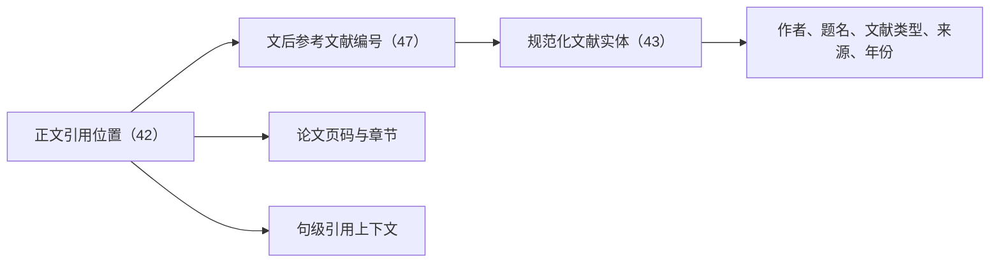

# 周宗萍硕士论文：参考文献引用映射

> [!important] 结论
> 这篇硕士论文已经建立“文后编号—规范化文献实体—正文引用位置—引用上下文—书目来源”的映射。本任务以论文内部映射为范围，不逐篇取得被引文献原文；引用方式和用途保留为机器辅助分类。

## 映射规模

| 指标 | 结果 | 口径 |
|---|---:|---|
| 文后参考文献编号 | 47 | 论文参考文献表中的编号数 |
| 规范化文献实体 | 43 | 合并重复或共用书目条目后 |
| 正文引用位置 | 42 | 每个方括号编号出现位置计1次 |
| 正文涉及编号 | 41 | 47个编号中至少出现1次的编号 |
| 正文未检出编号 | 6 | 仅表示在本轮正文文本范围内未匹配 |
| 重复/共用书目组 | 3 | `[1]/[11]`、`[8]/[13]`、`[2]/[18]/[24]` |

## 完整数据文件

| 文件 | 粒度 | 主要字段 | 用途 |
|---|---|---|---|
| [[周宗萍_参考文献总表.csv]] | 47个文后编号 | 编号、实体ID、完整书目、作者、题名、来源、年份、引用次数、页码 | 查看论文书目表及引用覆盖 |
| [[周宗萍_规范化文献实体.csv]] | 43个去重实体 | 实体ID、关联编号、完整书目 | 避免重复编号造成重复计数 |
| [[周宗萍_正文引用位置.csv]] | 42个正文出现位置 | 编号、实体ID、PDF页、论文页、章节、引用上下文、机器分类 | 回到正文定位每一处引用内容 |
| [[周宗萍_参考文献引用映射.json]] | 完整映射包 | 论文信息、统计、书目、实体、正文出现位置 | 程序处理、知识图谱或后续导入 |

## 映射关系

例如，正文中的编号 `[1]` 和 `[11]` 分别出现在论文第1页和第2页，但都映射到实体 `E001`，即郑贤的《基于STEAM的小学〈3D打印〉课程设计与教学实践研究》。这说明“参考文献编号”与“独立文献实体”不能混为一谈。

## 重复或共用书目编号

| 编号组 | 实体ID | 书目 | 判定 |
|---|---|---|---|
| `[1]`、`[11]` | E001 | 郑贤. 基于STEAM的小学《3D打印》课程设计与教学实践研究 | 参考文献表把两个编号排在同一条目前 |
| `[8]`、`[13]` | E008 | 杨高云. 小学“3D打印教育”课堂教学设计研究 | 参考文献表把两个编号排在同一条目前 |
| `[2]`、`[18]`、`[24]` | E002 | 孙江山、吴永和、任友群. 3D打印教育创新：创客空间、创新实验室和STEAM | 三个编号的书目内容相同，仅存在空格和卷期格式差异 |

## 文后有条目、正文未检出的编号

| 编号 | 实体ID | 文献简称 |
|---:|---|---|
| 9 | E009 | 史玉升等：3D打印技术的发展及其软件实现 |
| 26 | E022 | Yakman & Lee：Exploring the Exemplary STEAM Education... |
| 29 | E025 | 杨丽：初中信息技术3D打印课程的探索与实践 |
| 30 | E026 | 王萍：3D打印及其教育应用初探 |
| 44 | E040 | 赵呈领等：面向STEM教育的5E探究式教学模式设计 |
| 47 | E043 | Hudson et al.：Exploring Links between Pedagogical Knowledge Practices... |

> [!caution]
> “正文未检出”不等于可以断言“作者没有使用”。它只表示在PDF第10—67页的可搜索文本中没有匹配到相应方括号编号；图像、脚注、格式异常或未纳入范围的页面仍可能造成漏检。

## 引用内容的初步分类

### 按用途

| 机器辅助分类 | 出现次数 |
|---|---:|
| 技术背景或应用依据 | 16 |
| 研究现状或文献观点 | 9 |
| 理论或教学模型依据 | 6 |
| 评价工具或方法依据 | 4 |
| 概念界定 | 3 |
| 政策或课程标准依据 | 2 |
| 背景论据或论述支持 | 2 |

### 按论文位置

| 章节 | 出现次数 |
|---|---:|
| 1.1 研究背景 | 11 |
| 1.2 国内外研究现状 | 10 |
| 2.2 理论基础 | 7 |
| 2.1 相关概念界定 | 6 |
| 3.2 课程大纲 | 4 |
| 1.3 研究意义和目的 | 3 |
| 第4章 教学设计与实施 | 1 |

这一分布表明，引用主要集中在绪论、概念界定和理论基础，进入课程设计与实施后显著减少。这是对引文位置的描述，不代表对论文质量的直接评价。

## 提取与匹配方法

1. 读取PDF文本层并保留PDF页码。
2. 从参考文献页识别方括号编号和续行书目信息。
3. 在论文正文第1—58页检索 `[数字]` 形式的编号。
4. 为每个出现位置截取句级上下文，记录PDF页、论文页和章节。
5. 将重复/共用编号合并到规范化实体ID。
6. 根据关键词对引用方式和用途作机器辅助分类。
7. 对参考文献页及部分正文引用页进行视觉抽查。

页面换算关系为：`论文正文页 = PDF页 - 9`。

## 来源字段的含义

本轮“来源”指论文参考文献表中写出的期刊、学校、出版社或论文集信息。例如，`source_container` 可为“中国电化教育”“上海师范大学”或“北京师范大学出版社”。它不是外部数据库核验结果，也不表示已取得被引文献全文。

如未来另有需要，可选择执行以下增强步骤；它们不属于本任务：

1. 为43个规范化实体逐条检索原始文献或权威题录。
2. 核验作者、题名、年份、卷期页码、DOI/数据库编号。
3. 将论文中的引用上下文与被引文献原文逐句对照。
4. 区分直接引语、准确转述、二手引用、错引和无法核实。
5. 核验无误后，再把每个实体提升为“一篇文献一条正式笔记”。

## 质量边界

- 参考文献表自身可能含排版错误、信息缺失和重复编号；当前数据保留其原貌，同时增加规范化实体层。
- PDF文本层存在断词、空格和页眉混入，CSV中的引用上下文是可追溯的机器提取结果，不是校订后的正式引文。
- `citation_mode` 与 `citation_purpose` 为启发式分类，不应直接作为实证编码结果。
- 本轮按用户确认的范围，不逐篇取得或核验43篇被引文献原文。

## 关联

- 论文文献卡：[[../基于STEAM教育理念的小学“3D打印”校本课程设计与实践研究]]
- 原始PDF：[[../../../60_原始资料/文献原文/基于STEAM教育理念的小学“3D打印”校本课程设计与实践研究_周宗萍.pdf]]
- 独立复核：[[../../08_材料分解/2026-07-27_周宗萍硕士论文_参考文献引用映射复核记录]]
