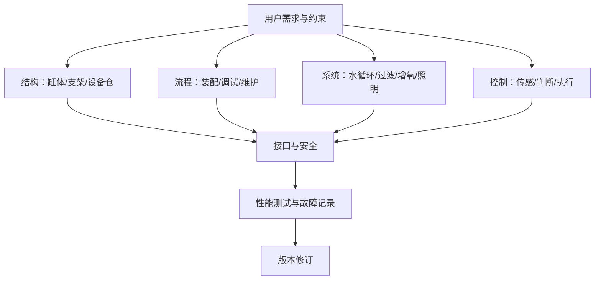
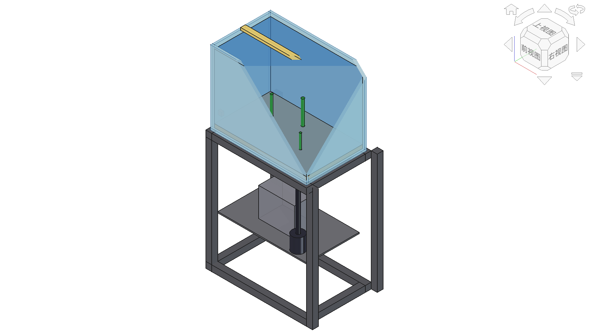

# 超越作品展示：高中技术与工程项目学习的测试、迭代与迁移

## 摘要

项目式学习是高中技术与工程课程落实核心素养的重要方式，但课堂实践中容易把项目成果等同于学习成果，使方案比较、性能测试、失败分析和迁移运用被最终作品所遮蔽。本文结合生态鱼缸课程开发，将项目升级为“校园智能生态水循环舱”，构建“真实需求—多方案决策—数字建模—原型测试—诊断改进—综合验收—情境迁移”的学习路径。课程以结构、流程、系统、控制四个大概念为主线，设置需求确认、方案评审、原型初测、迭代复测和综合验收五个关键教学节点，引导学生用测试结果说明作品表现，用版本变化呈现工程改进，并在陌生任务中迁移所学。该设计把作品制作、工程思维和学习评价连接起来，为高中技术与工程项目学习从“做出作品”走向“解决问题”提供了可操作的教学思路。

**关键词：** 高中技术与工程；项目式学习；大概念；工程测试；迭代；迁移评价

## 一、问题提出：从“做出作品”走向“经历工程”

项目式学习适合承载技术与工程课程中的复杂任务。学生需要在需求、材料、结构、工艺、系统关系、控制逻辑、安全、成本和维护之间作出选择，知识因而不再只是章节中的孤立条目。《普通高中通用技术课程标准（2017年版2020年修订）》要求学生经历工程设计的一般过程和基础实践，初步运用计算机建模与仿真，并认识工程决策和管理的重要性；在电子控制部分，还明确涉及控制系统的安装、调试和改进[1]。课程教材研究所发布的2025年解读专刊目录显示，技术与工程课程标准已有新一轮修订解读文本[2]；管光海公开发表的解读文章则把“真实问题解决”和体现工程复杂性、整体性的“完整任务”列为实施重点[3]。这些变化共同指向一个问题：技术与工程课堂不能只看最终作品是否出现，还要看学生如何界定问题、比较方案、依据测试修订设计，并把形成的理解迁移到新情境。

本研究前期已经形成生态鱼缸课程的基本资产：以一个项目贯穿结构、流程、系统、控制四个单元，计划16—20课时，配套4份教案和一套 EcoFishTank 数字模型。这些材料解决了跨单元内容如何围绕同一工程任务组织的问题，也为后续的数字化表达、系统分析和控制设计提供了共同载体。

在进一步设计课程时，笔者发现，仅仅把四个单元放进同一个项目还不够。如果学生只有一个方案、一次制作和一次展示，项目仍然可能停留在“按要求完成作品”的层面。为此，课程改进聚焦于三个问题：其一，学生为什么选择这个方案；其二，作品经过怎样的测试和修改才逐步完善；其三，离开生态鱼缸这一具体情境后，学生能否运用结构、流程、系统和控制的关系解决新的问题。

工程教育研究把设计视为准备、规划、评价方案的迭代过程，测试结果需要返回设计并推动再次改进[4]。项目式学习也强调在反馈、修订和完善中形成高质量成果[5]。因此，本文不再把最终展示作为项目终点，而是把“测试、迭代与迁移”嵌入教学全过程，使学生既能完成作品，又能说明作品为什么这样设计、怎样得到改进，以及所学能否用于新的工程问题。

## 二、教学思路：从内容贯通走向学习闭环

### （一）大概念不是单元标签，而是跨情境的关系结构

结构、流程、系统、控制可以分别成为教学单元，但“大概念贯通”的价值不在于四个词都出现在同一项目中，而在于学生能否解释它们的相互制约。例如，缸体与支架的结构选择会改变设备布置和维护流程；循环系统的接口和阻力会影响泵的选择与能耗；水温控制的设定值、传感位置和干扰恢复又依赖系统边界与结构空间。学生若只能复述概念定义，却不能说明这些关系，项目仍可能只是四次相邻的制作活动。

因此，学生对大概念的学习表现可以分成三个层次：第一层是“识别”，即能在项目中指出结构、流程、系统和控制要素；第二层是“解释”，即能用因果、约束、权衡和反馈说明概念之间的关系；第三层是“迁移”，即能在温室、校园节水或小型水培等陌生情境中重新界定系统边界、选择指标并提出可测试方案。迁移并非对原任务表面特征的复制，而是把形成的知识结构用于新问题[7]。作品是否运行只能覆盖其中一部分，不能替代解释与迁移表现。

### （二）完整工程任务必须包含决策、测试和重设计

作品导向的课堂常把“做出来”当作终点：学生只有一个方案，缺少比较和权衡；只有一次展示，缺少测试后的重新设计；只在熟悉情境中完成任务，难以判断能否迁移。较为完整的工程任务应形成以下链条：从真实需求出发，提出多个方案，依据标准作出选择，通过数字模型和原型表达设计，再经过测试、诊断和修改形成新版本，最后在新的任务中运用所学。

**图1 从大概念贯通到学习闭环的项目路径。** 来源：作者设计。

### （三）让学习过程留下可观察的成果

评价不应等到项目结束后才附加。教师需要先思考希望学生形成什么能力，再安排能够表现这些能力的任务[6]。例如，结构学习不能只对应“制作支架”，还应形成方案草图、承载测试和修改记录；系统学习不能只对应“讲解生态循环”，还应形成系统框图、接口说明以及流量、水温等测试记录；控制学习也不能满足于“程序能够运行”，还要观察学生能否根据响应情况调整参数和程序。

因此，项目中需要保留三类学习成果：一是方案草图、流程图、系统框图和程序等设计成果；二是测试记录、故障分析和版本修改等过程成果；三是学生的解释、反思和迁移任务等学习成果。三类成果相互补充，使评价不再只围绕最终作品展开。

## 三、案例重构：校园智能生态水循环舱

### （一）项目情境、用户与成功标准

项目面向校内班级、实验室或社团的公共空间，设计一套便于维护的“智能生态水循环舱”。教学中可邀请校内使用者参与需求确认，共同讨论使用位置、可用空间、供电与排水条件、维护责任、预算、安全要求和可接受噪声，使项目任务更贴近真实场景。

驱动问题为：**怎样用有限材料、空间和能耗，设计一套安全、稳定、可维护，并能用测试结果说明性能的校园智能生态水循环系统？** 评价标准由师生结合学校现有仪器、空间和课时共同确定。漏水、电气暴露、倾覆和过载等是必须满足的安全要求；流量、温度稳定、能耗、噪声和维护耗时则作为作品性能与使用体验的重要指标。

### （二）从作品制作到持续改进

| 维度 | 现有生态鱼缸课程 | 本文智能生态水循环舱 |
|---|---|---|
| 基本组织 | 一个项目贯穿结构、流程、系统、控制四单元 | 保留跨单元贯通，形成持续改进的学习闭环 |
| 课程资源 | 4份教案与教师数字模型 | 课程任务、关键节点和评价工具 |
| 用户参与 | 用户与委托情境尚未明确 | 实施前完成真实需求确认与变更记录 |
| 方案生成 | 以完成单元设计任务为主 | 至少形成两个可比较方案并说明权衡理由 |
| 工程测试 | 主要关注作品设计与制作 | 增加初测—诊断—修改—复测环节 |
| 学习评价 | 以单元任务和作品为主 | 将作品、过程、解释与迁移综合评价 |
| 失败处理 | 失败主要在制作中即时解决 | 把故障、诊断和改进过程转化为学习资源 |

**表1 生态鱼缸课程的改进前后比较。**

### （三）四大概念的任务—产物—指标矩阵

| 大概念 | 核心任务 | 阶段成果 | 可观察指标 | 教学关注 |
|---|---|---|---|---|
| 结构 | 缸体、支架与设备仓的承载和安全设计 | 多方案草图、CAD模型、结构样件 | 静载、变形、稳定、漏水与安全检查 | 结构选择与使用情境是否匹配 |
| 流程 | 装配、造景、调试和维护流程设计 | 流程图、工序表、风险清单 | 实际工时、返工、等待和流程变化 | 学生能否根据实践调整流程 |
| 系统 | 水循环、过滤、增氧、照明与生物要素整合 | 系统边界图、接口表、决策矩阵 | 流量、水温、水位、能耗和故障 | 学生能否解释要素间的联系 |
| 控制 | 温控、水位或照明控制设计 | 控制框图、接线或程序、原型 | 误差、响应、抗干扰和稳定运行 | 学生能否根据运行情况改进控制 |

**表2 四大概念对应的项目任务、成果与评价要点。**

四个大概念并不是四条互不相干的流水线。结构决定设备空间与接口位置；流程决定装配次序、返工风险和维护可达性；系统分析确定要素、边界与功能关系；控制通过传感、判断和执行调节系统状态。综合验收必须检查接口：例如传感器安装位置是否导致读数滞后，水路布置是否增加阻力，设备仓是否便于断电检修。

**图2 智能生态水循环舱四大概念任务与改进关系。** 来源：作者设计。

### （四）教师数字模型的有限作用

**图3 教师利用 FreeCAD 建立的生态鱼缸数字模型。** 来源：作者课程设计资料。

图3可作为项目导入和方案讨论的支架。学生通过观察缸体、支架、设备仓和水路部件的空间关系，发现结构布置、设备安装和后期维护之间的联系。在此基础上，各小组需要重新提出自己的设计方案，而不是简单复制教师模型。数字模型还可以用于尺寸调整、空间检查和版本比较，为后续实物制作和性能测试做好准备。

### （五）五个关键教学节点

| 教学节点 | 学生要回答的问题 | 阶段成果 | 教师指导 |
|---|---|---|---|
| 需求确认 | 为谁设计？需要满足哪些要求？ | 用户需求表、约束表、需求变化记录 | 引导学生补充访谈或现场观察 |
| 方案评审 | 为什么选择该方案而不是其他方案？ | 至少两个方案、决策矩阵、权衡说明 | 帮助学生完善标准、补充方案 |
| 原型初测 | 在什么条件下出现了什么结果？ | 测试方案、原始读数、失败照片或日志 | 指导学生规范测试条件并分析原因 |
| 迭代复测 | 哪项修改改善了哪个问题？ | 版本差异、修改理由、同条件复测 | 建立修改措施与测试结果的联系 |
| 综合验收 | 作品表现与学习目标是否一致？ | 验收表、运维说明、概念解释、迁移任务 | 通过答辩和新情境任务深化理解 |

这些节点并不是把课堂变成表格审批，而是帮助教师把握项目学习的关键过程。记录可以简洁，但方案比较、测试条件、失败原因、版本变化和迁移任务等核心环节不能省略。

## 四、教学实施：让测试和迭代真正进入课堂

### （一）围绕四个大概念安排连续任务

课程可在16—20课时内展开。结构单元重点完成需求分析、支架与缸体方案设计；流程单元重点完成装配、调试和维护流程；系统单元重点分析水循环、过滤、增氧、照明等要素的关系；控制单元重点完成传感器、执行器与控制程序的设计。四个单元不是简单拼接，而是围绕同一作品逐步深入。前一阶段形成的问题和成果直接进入后一阶段，学生始终面对的是同一个不断完善的工程系统。

| 教学阶段 | 主要活动 | 学习成果 | 教师关注 |
|---|---|---|---|
| 需求与结构设计 | 调查使用场景，提出支架、缸体和设备仓方案 | 需求表、多方案草图、数字模型 | 是否考虑安全、空间、材料和维护 |
| 流程与系统设计 | 规划装配、调试和维护流程，分析系统要素和接口 | 流程图、系统框图、接口表 | 是否理解结构、流程与系统的相互影响 |
| 原型制作与测试 | 制作原型，开展漏水、承载、流量、温度或控制测试 | 原型、测试记录、故障单 | 测试条件是否清楚，记录是否真实 |
| 诊断与迭代 | 根据测试结果查找原因，修改结构、流程或程序 | 版本对照、修改说明、复测记录 | 修改是否有依据，复测是否回应问题 |
| 展示与迁移 | 综合验收，并完成新的工程情境任务 | 作品说明、反思报告、迁移方案 | 能否解释改进过程并迁移核心方法 |

**表3 智能生态水循环舱项目的教学实施安排。**

### （二）把测试变成推动学习的关键事件

测试不是作品完成后的附加环节，而是学生重新认识问题的重要机会。结构测试可以关注支架稳定、可见变形和漏水情况；流程测试可以比较计划工时与实际工时，记录返工和等待；系统测试可以选择流量、水温、水位或能耗等学校能够测量的指标；控制测试则关注设定值、实际值、响应时间和干扰后的恢复情况。

教师不必追求复杂仪器和大量数据，关键是让学生回答三个问题：测试是在什么条件下进行的？结果说明了什么问题？下一版准备修改什么？只要学生能够根据真实现象提出解释并重新设计，测试就从“检查作品”转化为“促进学习”。

### （三）让版本变化呈现工程思维

学生常把修改理解为修补外观或排除故障。教师需要引导他们建立“现象—原因—证据—修改—复测”的思考链。例如，流量不足可能来自水泵选型、管路过长、弯头过多或过滤材料阻力过大；温度波动可能与传感器位置、控制阈值和环境干扰有关。不同原因对应不同修改，修改后还要在相近条件下重新测试。

因此，每组至少保存初始方案、测试后方案和最终方案三个版本。版本记录不求复杂，可以用照片、草图、CAD文件或简短表格呈现，但必须说明“改了什么、为什么改、结果怎样”。这比单纯展示一个完成度较高的终版更能体现学生的工程思维。

### （四）合理使用数字工具

FreeCAD用于帮助学生观察空间关系、调整尺寸和比较方案，不能代替实物制作与测试。人工智能可以辅助学生整理资料、检查表达和提出可能的问题，但方案选择、测试记录和改进理由必须由学生根据实际过程完成。教师还应把水电安全、结构稳定和工具操作作为项目底线，在保证安全的前提下为学生保留试错和改进空间。

## 五、教学评价：作品、过程与迁移并重

### （一）作品评价关注“能否说明为什么”

作品评价除了安全、功能和外观，还应关注学生能否说明方案与需求之间的关系，能否用测试结果解释作品表现。一个运行正常的作品，如果没有方案比较和测试记录，只能说明学生完成了制作；一个尚有不足的作品，如果经历了清楚的诊断、修改和复测，同样具有重要的学习价值。

### （二）过程评价关注“怎样一步步改进”

过程评价可围绕四个方面展开：是否提出了有实质差异的方案，是否依据需求和约束作出选择，是否开展了条件清楚的测试，是否根据测试形成了可说明的版本变化。教师可结合工程日志、阶段汇报、同伴评审和作品档案进行评价，避免把小组最终得分简单等同于每名学生的学习表现。

### （三）迁移评价关注“能否解决新的问题”

项目结束后，可设置小型水培、温室通风或校园雨水利用等新情境，要求学生重新界定用户需求、系统边界和工程约束，形成两个方案并设计测试方法。迁移任务不要求学生复制鱼缸外形，而是观察他们能否把方案比较、系统分析、控制设计和测试改进的方法用于新问题。迁移并非对原任务表面特征的复制，而是把形成的知识结构用于新情境[7]。

评价时可以将作品表现、项目过程和迁移任务分别计分，再结合学生的个人解释与反思形成综合判断。这样的评价既保留项目作品的吸引力，也使那些不容易在成品外观中显现的思考、选择和改进过程得到重视。

## 六、实践反思：项目学习如何超越作品展示

### （一）把项目成果转化为可观察的学习过程

相对于单纯用一个项目贯通多个单元，本设计更重视学生在项目中经历了什么。学生不仅提交最终方案，还要说明比较过哪些方案、依据什么作出选择；不仅展示作品能否运行，还要说明测试发现了什么、如何据此改进；不仅回答鱼缸项目中的问题，还要尝试在新的情境中运用相同的思考方法。

这种设计也改变了教师角色。教师要在需求阶段帮助学生区分真实需要和个人偏好，在方案阶段追问选择标准和取舍，在测试阶段帮助学生控制条件并守住安全底线，在迭代阶段追问修改依据，在验收阶段引导学生分别说明作品性能、改进过程和迁移思路。教师不是替学生解决问题，而是通过关键追问推动学生把经验上升为方法。

### （二）失败不是噪声，而是关键证据

工程学习的价值往往发生在第一次不成功之后。漏水、流量不足、传感器滞后、控制震荡、维护困难或流程返工，都能暴露学生最初认识的不足。如果课堂只展示终版，这些最有教育价值的过程就会消失。因此，教师应鼓励学生保存失败现象、分析原因、记录修改并再次测试，让“没有一次成功”成为理解工程迭代的真实资源。

但“失败有价值”不意味着可以牺牲安全。漏电、倾覆、玻璃破裂等高风险情形应由教师预先设置硬门并及时中止；学生可以分析风险和替代方案，不必通过真实危险来获得学习经验。

### （三）在教学深度与课堂负担之间保持平衡

测试和记录过多也可能挤压学生的制作时间。教师可以根据学校设备和课时条件选择少量关键指标，例如漏水、流量、水温、能耗或响应时间，不必追求复杂、昂贵的测量。记录形式也应尽量简洁，只要能够说明版本、测试现象和修改理由即可。同时，项目既有小组协作，也要保留个人解释和迁移任务，避免以小组作品的完成度代替每名学生的真实学习。

## 七、结论

大概念贯通解决的是“知识如何在一个项目中相互连接”，测试、迭代与迁移进一步解决的是“学生如何真正经历工程”。以校园智能生态水循环舱为载体，本文建立了真实需求、多方案决策、数字模型与原型、性能测试、失败诊断、版本改进、综合验收和情境迁移的连续任务链，并把结构、流程、系统、控制落实到具体活动和学习成果中。

这一设计的重点不是增加更多表格，而是改变项目学习的课堂节奏：让学生在方案比较中学会权衡，在性能测试中发现问题，在版本迭代中改进设计，在陌生情境中检验理解。只有超越对最终作品的单一关注，项目式学习才能真正发挥技术与工程课程在实践育人、工程思维和创新能力培养方面的价值。

## 参考文献

[1] 中华人民共和国教育部. 普通高中通用技术课程标准（2017年版2020年修订）[S]. 北京: 人民教育出版社, 2020.

[2] 顾建军, 管光海. 《普通高中技术与工程课程标准日常修订版（2017年版2025年修订）》解读[J]. 基础教育课程, 2025(12):68-70.

[3] 管光海. 基于真实问题解决的高中技术与工程课程实施——《普通高中技术与工程课程标准日常修订版（2017年版2025年修订）》的理念变化和实施建议[J]. 福建教育, 2025(24):75-80.

[4] National Academies of Sciences, Engineering, and Medicine. Building Capacity for Teaching Engineering in K-12 Education[M]. Washington, DC: The National Academies Press, 2020. DOI:10.17226/25612.

[5] LARMER J. Gold Standard PBL: Critique and Revision[EB/OL]. PBLWorks, 2016-02-29[2026-08-02]. https://www.pblworks.org/blog/gold-standard-pbl-critique-and-revision.

[6] MISLEVY R J, STEINBERG L S, ALMOND R G. On the structure of educational assessments[J]. Measurement: Interdisciplinary Research and Perspectives, 2003, 1(1):3-62. DOI:10.1207/S15366359MEA0101_02.

[7] BRANSFORD J D, BROWN A L, COCKING R R, eds. How People Learn: Brain, Mind, Experience, and School: Expanded Edition[M]. Washington, DC: National Academy Press, 2000. DOI:10.17226/9853.
