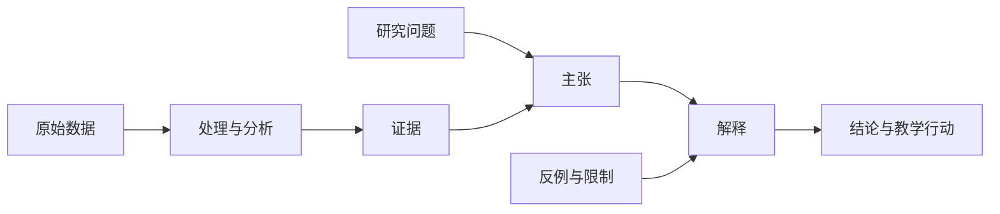

# 分析与成果总览

## 从数据到成果

1. `01_分析备忘`：记录每次统计、编码、比较和解释过程。
2. `02_证据链`：把每条主张连接到具体数据、分析和原始来源。
3. `03_结论`：写清支持程度、反例、限制和适用边界。
4. `04_论文课题案例`：形成论文、课题报告、教学案例、公开课和资源包。

## 证据链最小结构

使用 [[../90_模板/分析备忘模板]] 和 [[../90_模板/证据链模板]]。

## 最近分析备忘

- [[01_分析备忘/被严重低估的通用技术_能力框架]]

## 最近证据链

- [[02_证据链/被严重低估的通用技术_主张证据链]]
- [[02_证据链/小绿盒无蚊公园_主张证据链]]

